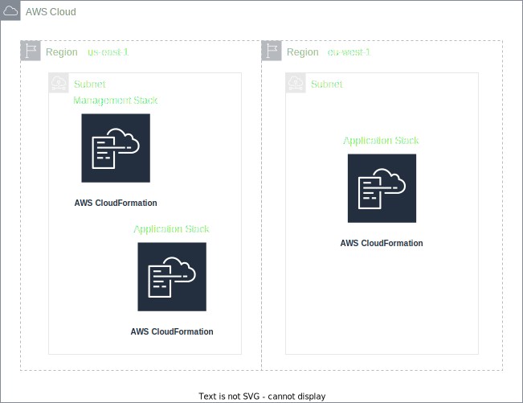

# Multi Region Stack Example

This is an example of one way to deploy multiple Cloudformation stacks to different regions, without having forks within the code.

After deployment has completed, you should find function urls listed in your CLI corresponding to the regions you deployed to. Opening them should respond with `Hello from ${region}`

The `cdk.json` file tells the CDK Toolkit how to execute your app.

## Credentials
By default this assumes you have an AWS profile configured, and will use the default account and region associated with it. The default is the account the credentials belong to and (typically) us-east-1.

If you would like to target a specific account and environment, you can modify `bin/multi-region-example.ts` to use either of the commented `env` lines. One is for hard coding the other is for environment variables. You can [learn more about CDK environments here](https://docs.aws.amazon.com/cdk/latest/guide/environments.html).

## Useful commands

* `npm run build`   compile typescript to js
* `npm run watch`   watch for changes and compile
* `npm run test`    perform the jest unit tests
* `npm run deploy`  deploy this stack to your default AWS account/region, and the sub stacks to the regions specified in `multi-region-example-stack.ts`
* `npx cdk diff`    compare deployed stack with current state
* `npx cdk synth`   emits the synthesized CloudFormation template
